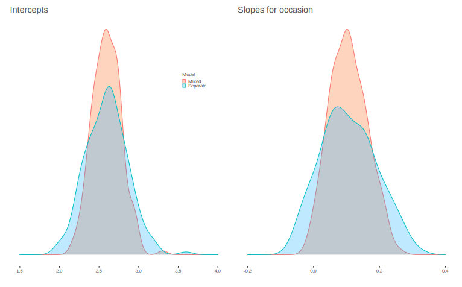
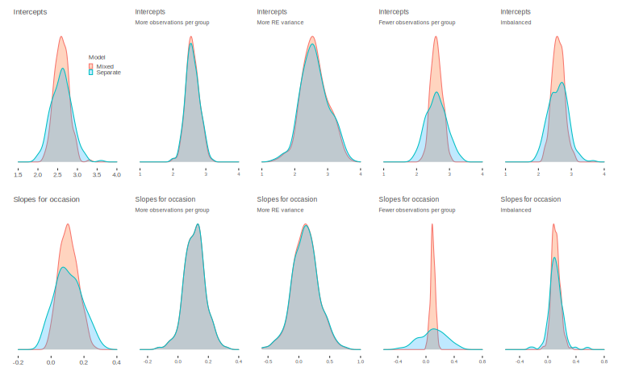
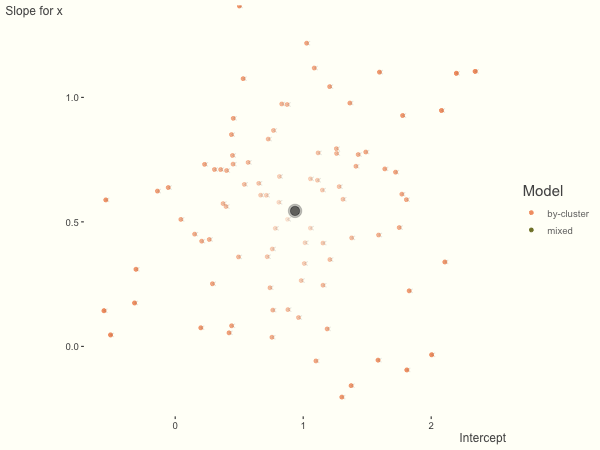

class: inverse middle center


```{r setup, include=FALSE}
options(htmltools.dir.version = FALSE, crayon.enabled = FALSE) # see https://github.com/hadley/mastering-shiny/issues/132

knitr::opts_chunk$set(
  # code
  echo      = T,
  eval      = T,
  message   = F,
  warning   = F,
  error     = F,
  comment   = NA,
  R.options = list(width = 220),
  # viz
  dev.args  = list(bg = 'transparent'),
  dev       = 'svglite',
  fig.align = 'center',
  out.width = '75%',
  fig.asp   = .75,
  # cache
  cache.rebuild = F,
  cache         = F
)

kable_df = function(data, digits=3, ...) {
  kableExtra::kable(
    data,
    digits = digits,
    format = 'html',
    booktabs = T,
    # longtable = F,
    linesep = "",
    ...,
  ) %>% 
    kableExtra::kable_styling(full_width = F)
}

perc = function(x, digits = 1) paste(rnd(x*100, digits = digits), '%')
```

```{r setup-extra, echo=FALSE, eval=TRUE}
xaringanExtra::use_xaringan_extra(
  c(
    "tile_view",
    "animate_css",
    "tachyons",
    'clipboard',
    'fit_screen',
    'webcam',
    'panelset'
  )
)

xaringanExtra::use_logo(
  image_url = 'https://raw.githubusercontent.com/m-clark/m-clark.github.io/master/img/mc_logo.png',
  link_url = 'https://m-clark.github.io',
  width = '5%',
  position =  xaringanExtra::css_position(bottom = "-3em", left = "1em"),
  exclude_class = c("title-slide")
)

xaringanExtra::use_animate_css()

xaringanExtra::style_share_again(
  share_buttons = c("twitter", "linkedin", "pocket")
)
```


```{r setup-packs, include = F, eval=TRUE}
library(tidyverse)
library(plotly)
library(visibly)
library(scico)
library(mixedup)
library(lme4)

load('../data/gpa.RData')
# load('data/gpa')

gpa_lm = lm(gpa ~ occasion, data = gpa)
```


### *Overview of Random Effects*

### <span class="" style = "">**More Random Effects**</span>

### *Common Extensions*

### *Issues*

### *Bayesian Approaches*


---
class: img-slide-from-doc


---
class: inverse 

# More: Application

So far we've assumed a constant trend over semester for each student.

--

<br>

Should we?

---
class: inverse

Let's add random slopes to the mix!


```{r echo = F}
library(lme4)
load('../data/gpa.RData')
# load('data/gpa.RData')
```


```{r }
gpa_mixed =  lmer(gpa ~ occasion + (1 + occasion | student), data = gpa)
```

Examine the fixed effects: 

```{r }
# fixef(gpa_mixed)
extract_fixed_effects(gpa_mixed)
```

---
class: inverse 

# More: Application

Examine the variance components:

```{r}
# VarCorr(gpa_mixed)
extract_vc(gpa_mixed, show_cor = TRUE, ci_level = FALSE)
```

What is our interpretation? <span class="" style = "font-size: 200%">🤔</span>


---
class: inverse 

# More: Application

The intercept variance tells us...

--

... how much that starting GPA bounces around from student to student.
- Occasion starts at zero


---
class: inverse slide-font-75

# More: Application

The slope variance/sd tells us...

--

... how much that trend bounces around from student to student.
- Is it large?
    - Different scale than intercept
    - Compare to the average value: `r round(fixef(gpa_mixed)[2], 2)`
    - Given a normal distribution, we could expect most students to fall somewhere between a flat effect of zero to more than double the population average
    - $\pm$ 2\*sd (`r extract_vc(gpa_mixed, ci_level= 0)$sd[2]`) -> `r round(fixef(gpa_mixed)[2] -extract_vc(gpa_mixed, ci_level= 0)$sd[2]*2, 2)` : `r round(fixef(gpa_mixed)[2] +extract_vc(gpa_mixed, ci_level= 0)$sd[2]*2, 2)`


---
class: inverse

# More: Application

The correlation tells us...

--

... how much that trend is related to the intercept.

Starting our time indicator at 0, it is the correlation of the trend to the starting point.


---
class: inverse

# More: Mixed vs. Many


```{r eval=T, echo=FALSE}
gpa_lm_by_group = gpa %>%
  split(.$student) %>%
  map_df( ~ data.frame(t(coef(
    lm(gpa ~ occasion, data = .x)
  )))) %>%
  rename(Intercept = X.Intercept.)
```


```{r eval=FALSE, echo=FALSE}
gint = data_frame(
  Mixed = extract_random_coefs(gpa_mixed) %>% filter(effect == 'Intercept') %>% pull(value),
  Separate = gpa_lm_by_group %>% pull(Intercept)
) %>%
  pivot_longer(everything(),  names_to= 'Model', values_to = 'Intercept') %>%
  ggplot(aes(x = Intercept)) +
  geom_density(aes(color = Model, fill = Model), alpha = .25) +
  scale_fill_manual(values = c(palettes$orange$orange, palettes$orange$complementary[2])) +
  labs(x = '', y = '', title = 'Intercepts') +
  xlim(c(1.5, 4)) +
  theme_trueMinimal() +
  theme(
    axis.text.x = element_text(size = 8),
    axis.text.y = element_blank(),
    axis.ticks.y = element_blank(),
    legend.key.size = unit(2, 'mm'),
    legend.title = element_text(size = 8),
    legend.text = element_text(size = 8),
    legend.box.spacing = unit(0, 'in'),
    legend.position = c(.85, .75),
    title = element_text(size = 12)
  )

gslopes = data_frame(
  Mixed = extract_random_coefs(gpa_mixed) %>% filter(effect == 'occasion') %>% pull(value),
  Separate = gpa_lm_by_group %>% pull(occasion)
) %>%
  pivot_longer(everything(),  names_to = 'Model', values_to = 'Occasion') %>%
  ggplot(aes(x = Occasion)) +
  geom_density(aes(color = Model, fill = Model),
               alpha = .25,
               show.legend = F) +
  scale_fill_manual(values = c(palettes$orange$orange, palettes$orange$complementary[2])) +
  labs(x = '', y = '', title = 'Slopes for occasion') +
  xlim(c(-.2, .4)) +
  theme_trueMinimal() +
  theme(
    axis.text.x = element_text(size = 8),
    axis.text.y = element_blank(),
    axis.ticks.y = element_blank(),
    title = element_text(size = 12)
  )

library(patchwork)
p = gint + gslopes
ggsave('docs/img/pooling1.png', width = 6, height = 4)
```

*Regularization, shrinkage, partial-pooling*




---
class: img-slide

# More: Mixed vs. Many




---
class: img-slide

```{r eval = F, echo = F}
library(brolgar)

gpa_ts <- as_tsibble(
  gpa,
  key = student,
  index = occasion,
  regular = TRUE
)

gpa_feat = gpa_ts %>% 
  features(gpa_mixed, feat_spread)

library(gghighlight)
gpa_ts %>% 
  features(gpa, feat_spread) %>% 
  left_join(gpa_ts) %>% 
  mutate(var_type = NA,
         var_type = case_when(
           var > quantile(var, .95) ~ 'Variable',
           var < quantile(var, .05) ~ 'Constant'
         )) %>% 
  ggplot(aes(x = occasion, y = gpa, color = var_type, group = student)) +
  geom_line() +
  gghighlight(!is.na(var_type), unhighlighted_params = list(size = .1), use_direct_label = F) +
  geom_point(alpha = .5) +
  labs(subtitle = 'Comparing highly variable vs. fairly constant') +
  scale_color_scico_d(end = .6) + 
  # guides(color = guide_colorbar(title = NULL)) +
  theme_clean()
```

```{r echo = F, out.width='150%'}
library(gghighlight)
# going_down_now = factor(rep(coef(gpa_mixed)$student[, 'occasion'] < 0, e =6), 
#                         labels = c('Up', 'Down'))
going_down_now = extract_random_coefs(gpa_mixed) %>% 
  filter(effect == 'occasion') %>% 
  mutate(going_down_now = factor(value < 0, labels = c('Up', 'Down'))) %>% 
  pull(going_down_now)
going_down_now = rep(going_down_now, e = 6)
  

gpa %>%
  modelr::add_predictions(gpa_lm, var = 'lm') %>%
  modelr::add_predictions(gpa_mixed, var = 'mixed') %>%
  group_by(student) %>%
  ggplot(aes(x = occasion, y = mixed, group = student)) +
  geom_line(color = '#b20076') +  # amounts to highlight color
  labs(y = 'mixed fits', title = 'Predictions from mixed model') +
  gghighlight(
    going_down_now == 'Down',
    label_key = F,
    unhighlighted_params = list(color = 'gray92')
  ) +
  theme_clean()
```

---
class: img-slide

```{r echo = F, out.width='150%'}
going_down_now = factor(rep(gpa_lm_by_group$occasion < 0, e = 6),
                        labels = c('Up', 'Down'))

gpa_lm_by_group_fits = gpa %>%
  split(.$student) %>%
  map( ~fitted(lm(gpa ~ occasion, data = .x))) %>% 
  unlist()

gpa %>%
  mutate(lm = gpa_lm_by_group_fits) %>%
  group_by(student) %>%
  ggplot(aes(x = occasion, y = lm, group = student)) +
  geom_line(color = '#b20076') +  # amounts to highlight color
  labs(y = 'lm fits', title = 'Predictions from cluster lm') +
  gghighlight(
    going_down_now == 'Down',
    label_key = F,
    unhighlighted_params = list(color = 'gray92')
  ) +
  theme_clean()
```


---
class: middle img-slide-from-doc





---
class: inverse

# Summary of Random Slopes


*Richly Parameterized Linear Models*

Relative to a standard regression we get...
- Extra variance parameters
    - Adds to our understanding of the sources of uncertainty in the model
- We can get the subjects specific effects
  - And their correlation
- We can use that information to get better predictions. 

--

What's not to like? 😄


---
class: inverse 

# Exercises

#### Sleep revisited

Run the sleep study model with random coefficient for the Days effect, and interpret the results.  What is the correlation between the intercept and Days random effects?  Use the <span class="func">ranef</span> and <span class="func">coef</span> functions on the model you've created to inspect the individual specific effects. What do you see?

```{r sleepstudy2}
library(lme4)
data("sleepstudy")
```

---
class: inverse 

# Exercises

#### Sleep revisited

In the following, replace <span class="objclass">model</span> with the name of your model object. Run each line, inspecting the result of each as you go along. 

```{r ex-sleep, eval=FALSE}
re = ranef(model)$Subject
fe = fixef(model)

apply(re, 1, function(x) x + fe) %>% t()
```

The above code adds the fixed effects to each row of the random effects (the <span class="func">t</span> just transposes the result). What is the result compared to what you saw before?


---
class: inverse middle center

# Moving on...


# [Part 1](https://m-clark.github.io/mixed-models-with-R-workshop/part-1.html)  <span class="" style = "width: 50px; display: inline-block"></span>[Part 3](https://m-clark.github.io/mixed-models-with-R-workshop/part-3.html)  <span class="" style = "width: 50px; display: inline-block"></span>[Part 4](https://m-clark.github.io/mixed-models-with-R-workshop/part-4.html)  <span class="" style = "width: 50px; display: inline-block"></span>[Part 5](https://m-clark.github.io/mixed-models-with-R-workshop/part-5.html)
