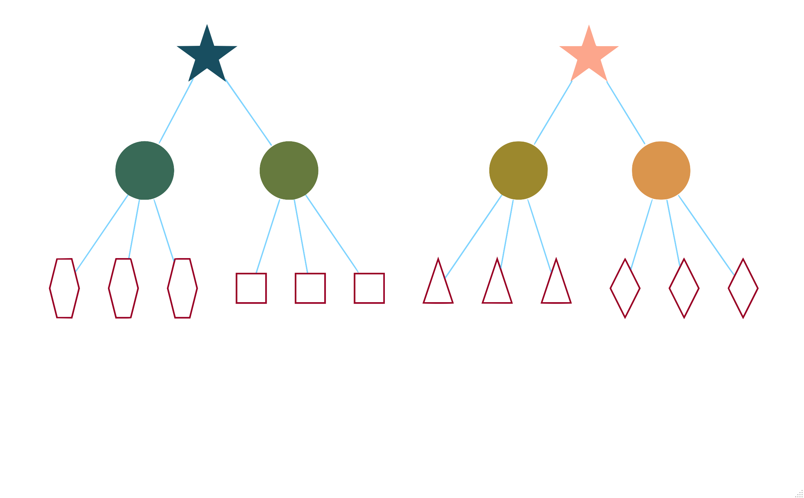

class: inverse middle center


```{r setup, include=FALSE}
options(htmltools.dir.version = FALSE, crayon.enabled = FALSE) # see https://github.com/hadley/mastering-shiny/issues/132

knitr::opts_chunk$set(
  # code
  echo      = T,
  eval      = T,
  message   = F,
  warning   = F,
  error     = F,
  comment   = NA,
  R.options = list(width = 220),
  # viz
  dev.args  = list(bg = 'transparent'),
  dev       = 'svglite',
  fig.align = 'center',
  out.width = '75%',
  fig.asp   = .75,
  # cache
  cache.rebuild = F,
  cache         = F
)

kable_df = function(data, digits=3, ...) {
  kableExtra::kable(
    data,
    digits = digits,
    format = 'html',
    booktabs = T,
    # longtable = F,
    linesep = "",
    ...,
  ) %>% 
    kableExtra::kable_styling(full_width = F)
}

perc = function(x, digits = 1) paste(rnd(x*100, digits = digits), '%')
```

```{r setup-extra, echo=FALSE, eval=TRUE}
xaringanExtra::use_xaringan_extra(
  c(
    "tile_view",
    "animate_css",
    "tachyons",
    'clipboard',
    'fit_screen',
    'webcam',
    'panelset'
  )
)

xaringanExtra::use_logo(
  image_url = 'https://raw.githubusercontent.com/m-clark/m-clark.github.io/master/img/mc_logo.png',
  link_url = 'https://m-clark.github.io',
  width = '5%',
  position =  xaringanExtra::css_position(bottom = "-3em", left = "1em"),
  exclude_class = c("title-slide")
)

xaringanExtra::use_animate_css()

xaringanExtra::style_share_again(
  share_buttons = c("twitter", "linkedin", "pocket")
)
```


```{r setup-packs, include = F, eval=TRUE}
library(tidyverse)
library(plotly)
library(visibly)
library(scico)
library(mixedup)
library(lme4)

load('../data/gpa.RData')
load('../data/pupils.RData')
load('../data/nurses.RData')
load('../data/speed_dating.RData')
load('../data/sociometric.RData')
# load('data/gpa')
```


### *Overview of Random Effects*

### *More Random Effects*

### **Common Extensions**

### *Issues*

### *Bayesian Approaches*


---
class: inverse middle center animated rollIn rollOut # https://animate.style/ 

# Additional Grouping Structure

---
class: inverse 

# Additional Grouping Structure: <br>Cross-classified Models

Often there is additional clustering/grouping.

Example:
- Items on a test
- Everyone sees all/multiple items
- Observations clustered within person and item

Terminology: *cross-classified models*

More generic: *non-nested*

---
class: middle img-slide


---
class: inverse 

# Additional Grouping Structure: <br>Nested Models

Sometimes we have clusters nested within other clusters
  
- Possibly nested within still other clusters.
  
Example:
  
  - Repeated observations of people
  - Observations nested within person
  - People nested within county
  - County within state

---
class: middle img-slide




---
class: inverse 

# Additional Grouping Structure


Nested scenarios are a special case of general (non-nested) clustering


Whether factors are crossed or nested is property of the data...

*Not the model!*


---
class: inverse 

# Example: Crossed 

Student Achievement
>Achievement scores for students. The sources of dependency are due to students having gone to the same primary or secondary schools. However, in this example, going to a primary school doesn’t necessarily mean you’ll go to a specific secondary school.

```{r echo=FALSE}
DT::datatable(pupils %>% slice_sample(n = 200),
              options = list(
                dom = 'tp',
                scrollX = T,
                autoWidth = T
              ,
              columnDefs = list(list(width = '100px', targets = 1),
                                list(width = '100px', targets = 3))),
              rownames = F)
```

---
class: inverse 

# Example: Crossed 

```{r cross_classified, eval = -1}
load('data/pupils.RData')

pupils_crossed = lmer(
  achievement ~ sex + ses 
  + (1|primary_school_id) + (1|secondary_school_id),
  data = pupils
)
```

Examine the fixed effects: 

```{r}
extract_fixed_effects(pupils_crossed)
```

---
class: inverse 

# Example: Crossed 

Examine the variance components:

```{r}
extract_vc(pupils_crossed, ci_level = FALSE)
```

What is our interpretation? <span class="" style = "font-size: 200%">🤔</span>

- Think about the range of achievement scores
    - range: `r range(pupils$achievement)`  
    - sd: `r round(sd(pupils$achievement), 2)`

---
class: middle img-slide

```{r eval=F, echo=FALSE}
p = merTools::plotREsim(merTools::REsim(pupils_crossed)) +
  theme_clean()
p
```


---
class: inverse 

# Example: Nested 

Nursing
>For our demonstration we'll use the nurses data set. Here we are interested in the effect of a training program (`treatment`) on stress levels (on a scale of 1-7) of nurses.  In this scenario, nurses are nested within wards, which themselves are nested within hospitals, so we will have random effects pertaining to ward (within hospital) and hospital.

```{r echo=FALSE}
DT::datatable(nurses %>% slice_sample(n = 200),
              options = list(
                dom = 'tp',
                scrollX = T,
                autoWidth = T
              ,
              columnDefs = list(list(width = '100px', targets = 1),
                                list(width = '100px', targets = 3))),
              rownames = F)
```

---
class: inverse 

# Example: Nested 

Different ways to do this.

```{r eval=-1}
load('data/nurses.RData')

nurses_hierarchical = lmer(
  stress ~ age + sex + experience + treatment + wardtype + hospsize
  + (1 | hospital) + (1 | hospital:ward),
  data = nurses
)
```


```{r eval=F}
nurses_hierarchical = lmer(
  stress ~ age  + sex + experience + treatment + wardtype + hospsize
  + (1 | hospital/ward),
  data = nurses
)
```


```{r eval=F}
summary(nurses_hierarchical, correlation = F)
```

---
class: inverse 

Examine the fixed effects: 

```{r}
# lme4::fixef(nurses_hierarchical)
extract_fixed_effects(nurses_hierarchical)
```

---
class: inverse 

# Example: Nested 

Examine the variance components:

```{r}
extract_vc(nurses_hierarchical, ci_level = FALSE)
```

What is our interpretation? <span class="" style = "font-size: 200%">🤔</span>

- Think about the range of stress scores
    - range: `r range(nurses$stress)`  
    - sd: `r round(sd(nurses$stress), 2)`
    
---
class: middle img-slide

```{r eval=F, echo=FALSE}
p = merTools::plotREsim(merTools::REsim(nurses_hierarchical)) +
  theme_clean()
p
```


---
class: inverse 

# Example: Nested 

What if we'd treated it as crossed?

```{r}
nurses_hierarchical = lmer(
  stress ~ age + sex + experience + treatment + wardtype + hospsize
  + (1 | hospital) + (1 | ward),
  data = nurses
)

extract_vc(nurses_hierarchical, ci_level=0)
```

---
class: inverse 

# Example: Nested 

But...

```{r}
nurses_hierarchical = lmer(
  stress ~ age + sex + experience + treatment + wardtype + hospsize
  + (1 | hospital) + (1 | wardid),
  data = nurses
)

extract_vc(nurses_hierarchical, ci_level=0)
```

---
class: inverse 

# Example: Nested 

What was the difference?

--

`wardid` properly contains unique values for each ward

`ward` is just numbered `1:*` for each hospital

--

So if your labels are correct...

... you can always just used 'crossed' style. 😃


---
class: inverse middle center animated rollIn rollOut # https://animate.style/ 

# Residual Structure

---
class: img-slide slide-font-75 slide-title-90

# Residual Structure


Correlation matrix of observations

```{r echo = F }
gpa_mixed = lmer(gpa ~ occasion + (1 | student), data = gpa)
vc = extract_vc(gpa_mixed, ci_level = 0)

```


- <span style = "font-size: 75%">3 students from GPA data</span>
- <span style = "font-size: 75%">ICC: `r vc$variance[1]` / (`r vc$variance[1]`  + `r vc$variance[2]`) = `r vc$var_prop[1]`</span>
- <span style = "font-size: 75%">Total variance = `r vc$variance[1]`  + `r vc$variance[2]` =  `r vc$variance[1] + vc$variance[2]`</span>


```{r echo = F, out.width= '66%'}
rescov <- function(model, data) {
  var.d <- crossprod(getME(model,"Lambdat"))
  Zt <- getME(model,"Zt")
  vr <- sigma(model)^2
  var.b <- vr*(t(Zt) %*% var.d %*% Zt)
  sI <- vr * Diagonal(nrow(data))
  var.y <- var.b + sI
  invisible(var.y)
}
gpa_vis_cov = lmer(gpa ~ occasion + (1|student), data=gpa)
# summary(gpa_vis_cov)

rc1 <- rescov(gpa_vis_cov, gpa)
# image(rc1[1:60,1:60])
rc1[1:18, 1:18] %>%
  as.matrix() %>%
  round(3) %>% 
  reshape2::melt() %>%
  mutate(value = factor(round(value, 5))) %>%
  ggplot(aes(Var1, Var2, fill = value)) +
  geom_tile(color = 'gray92', size = 1) +
  scale_y_continuous(trans = 'reverse') +
  scale_fill_manual(values = c('gray92', '#00aaff80', '#ff550080')) +
  theme_void() +
  theme(
    legend.key = ggplot2::element_rect(fill = 'transparent', colour = NA),
    legend.text = element_text( size = 12),
    legend.background = ggplot2::element_rect(fill = 'transparent', colour = NA),
    panel.background = ggplot2::element_blank(),
    panel.grid = ggplot2::element_blank(),
    strip.background = ggplot2::element_blank(),
    plot.background = ggplot2::element_rect(fill = "transparent", colour = NA)
  )
```

---
class: img-slide-less-pad

# Residual Structure

Mixed model default: constant covariance/correlation

$$\Sigma = 
\left[
\begin{array}{ccc} 
\color{orange}{\sigma^2 + \tau^2} & \tau^2   & \tau^2  & \tau^2 & \tau^2 & \tau^2   \\
\tau^2   & \color{orange}{\sigma^2 + \tau^2} & \tau^2 & \tau^2 & \tau^2 & \tau^2    \\
\tau^2   & \tau^2   & \color{orange}{\sigma^2 + \tau^2} & \tau^2 & \tau^2 & \tau^2  \\
\tau^2   & \tau^2   & \tau^2 & \color{orange}{\sigma^2 + \tau^2} & \tau^2 & \tau^2\\
\tau^2   & \tau^2   & \tau^2  & \tau^2 & \color{orange}{\sigma^2 + \tau^2}  & \tau^2 \\
\tau^2   & \tau^2   & \tau^2  & \tau^2   & \tau^2  & \color{orange}{\sigma^2 + \tau^2} \\
\end{array}\right]$$


---
class: img-slide-less-pad

# Residual Structure

Consider the following model
- single group with just three observations

$$\boldsymbol{y} \sim \mathcal{N}(\boldsymbol{\mu}, \boldsymbol{\Sigma})$$

---
class: img-slide-less-pad

# Residual Structure

Standard linear regression:

$$\Sigma = 
\left[
\begin{array}{ccc} 
\sigma^2 & 0   & 0   \\
0   & \sigma^2 & 0   \\
0   & 0   & \sigma^2 \\
\end{array}\right]$$

Heterogeneous variances:

$$\Sigma = 
\left[
\begin{array}{ccc} 
\sigma_1^2 & 0   & 0   \\
0   & \sigma_2^2 & 0   \\
0   & 0   & \sigma_3^2 \\
\end{array}\right]$$


---
class: img-slide-less-pad

# Residual Structure

Covariance structure (constant variance):

$$\Sigma_\sigma = 
\left[
\begin{array}{ccc} 
\sigma^2 &\sigma_{12}   & \sigma_{13}   \\
\sigma_{21}    & \sigma^2 &  \sigma_{23}    \\
\sigma_{31}   & \sigma_{32}   & \sigma^2 \\
\end{array}\right]$$

As correlation structure:

$$\Sigma_\rho = \sigma^2
\left[
\begin{array}{ccc} 
1 & \rho_{12}   & \rho_{13}   \\
\rho_{21}   & 1 & \rho_{23}   \\
\rho_{31}   & \rho_{32}   & 1 \\
\end{array}\right]$$

---
class: inverse

# Residual Structure

Take home message:

- Can go from full independence to any correlation structure imaginable
- Residual variance can even have its own model!

---
class: inverse

# Heterogeneous variance

```{r}
library(glmmTMB)

heterovar_res2 = glmmTMB(
  gpa ~ occasion + (1|student) + diag(0 + occas |student), 
  data = gpa
)
```

---
class: code-only slide-title-90

# Heterogeneous variance

```{r}
summary(heterovar_res2)
```


---
class: inverse

# Heterogeneous variance

glmmTMB treats this as an additional random effect:

$$y = X\beta + \mathrm{re}_{student} + \mathrm{re}_{hetvar} + \epsilon$$

For example, within a person, this new random effect would be something like:

```{r echo=-1}
est_variances = extract_het_var(heterovar_res2, scale = 'var')[-1]
covmat = diag(est_variances)
MASS::mvrnorm(1, mu = rep(0, 6), Sigma = covmat)
```

---
class: inverse

# Autocorrelation

When observations are measured over time, we can estimate something like the following, or anything that might be appropriate.

- Auto-regressive with lag 1 (AR1)
- Correlation decreases with spread in time

<span class="" style = "font-size:75%">
$$\Sigma = \sigma^2
\left[
\begin{array}{cccc} 
1 & \rho     & \rho^2   & \rho^3   \\
\rho     & 1 & \rho     & \rho^2   \\
\rho^2   & \rho     & 1 & \rho     \\
\rho^3   & \rho^2   & \rho     & 1 \\
\end{array}\right]$$
</span>

---
class: inverse

# Autocorrelation

If $\rho$ was estimated to be .5:

<span class="" style = "font-size:100%">
$$\Sigma = \sigma^2
\left[
\begin{array}{cccc} 
1 & .5       & .25      & .06   \\
.5       & 1 & .5       & .25  \\
.25      & .5       & 1 & .5    \\
.06      & .25      &  .5      & 1 \\
\end{array}\right]$$
</span>

---
class: inverse

# Autocorrelation

glmmTMB again estimates this as a separate random effect
- `occas` is the factor form of occasion
- also provides AR standard deviation/variance
- Not all output will be depicted the same way across packages

```{r corr_residual_glmmTMB}
corr_res_tmb = glmmTMB(
  gpa ~ occasion +  ar1(0 + occas | student) + (1 | student),
  data = gpa
)
```

---
class: inverse

# Autocorrelation

```{r}
summary(corr_res_tmb)
```

---
class: inverse

# Autocorrelation

What is our interpretation? <span class="" style = "font-size: 200%">🤔</span>

The estimated AR correlation is `r extract_cor_structure(corr_res_tmb, which_cor = 'ar1')$student`.

So within a person, the AR orrelation structure is something like this:

<span class="" style = "font-size:90%">
$$\Sigma_{ar} = \sigma^2_{ar}
\left[
\begin{array}{cccc} 
1   &   . &   . &   . &   . & . \\
.84 &   1 &   . &   . &   . & . \\
.71 & .84 &   1 &   . &   . & . \\
.60 & .71 & .84 &   1 &   . & . \\
.51 & .60 & .71 & .84 &   1 & . \\
.43 & .51 & .60 & .71 & .84 & 1 \\
\end{array}\right]$$
</span>


---
class: inverse middle center animated fadeIn fadeOut # https://animate.style/ 

# Generalized Linear Models

---
class: inverse 

# Generalized Linear Models

We can generalize (linear) mixed models

Data: speed dating

>In the speed dating events, the experiment randomly assigned each participant to ten short dates (four minutes) with other participants. For each date, each person rated six attributes (attractive, sincere, intelligent, fun, ambitious, shared interests) of the other person on a 10-point scale and wrote down whether he or she would like to see the other person again. Our target variable is whether the participant would be willing to date the person again (decision). 

---
class: inverse 

# Generalized Linear Models

For <span class="pack" style = "">lme4</span>, we just switch from <span class="func" style = "">lmer</span> to <span class="func" style = "">glmer</span>

```{r eval= -1}
load('data/speed_dating.RData')

sd_model = glmer(
  decision ~ sex + samerace + attractive_sc + sincere_sc + intelligent_sc
  + (1 | iid),
  data   = speed_dating,
  family = binomial
)

# summary(sd_model, correlation = FALSE)
```

---
class: inverse slide-font-75 slide-title-90

# Generalized Linear Models

No residual variance estimate for binomial
- No straightforward ICC

```{r, message=TRUE}
summarize_model(sd_model, ci = F)
```

---
class: inverse slide-font-75 slide-title-90

# Generalized Linear Models

Interpretation of fixed effects similar to GLM

However, these are not population averages

Conditional on the random effects:
- Not exactly the same as they are in GLM
- Slightly larger vs. GEE or basic logistic

---
class: inverse 

# Exercises


##### Sociometric data

In the following data, kids are put into different groups and rate each other in terms of how much they would like to share some activity with the others. We have identifying variables for the person doing the rating (sender), the person being rated (receiver), what group they are in, as well as age and sex for both sender and receiver, as well as group size.

---
class: inverse 

# Exercises

To run a mixed model, we will have three sources of structure to consider:

- senders (within group)
- receivers (within group)
- group

First, load the sociometric data. 

```{r load_socio, eval=FALSE}
load('data/sociometric.RData')
```

---
class: inverse slide-title-90 slide-font-75 slide-less-pad 

# Exercises


To run the model, we will proceed with the following modeling steps. For each, make sure you are creating a separate model object for each model run.

- <span style = "font-size: 75%">*Model 1*: No covariates, only sender and receiver random effects. Note that even though we don't add group yet, still use the nesting approach to specify the effects (e.g. `1|group:receiver`)</span>
- <span style = "font-size: 75%">*Model 2*: No covariates, add group random effect</span>
- <span style = "font-size: 75%">*Model 3*: Add all covariates: `agesend/rec`, `sexsend/rec`, and `grsize` (group size)</span>
- <span style = "font-size: 75%">*Model 4*: In order to examine sex matching effects, add an interaction of the sex variables to the model `sexsend:sexrec`.</span>
- <span style = "font-size: 75%">Compare models with AIC.</span>

```{r socio, echo=F, eval=FALSE}
model1 = lmer(rating ~ (1|group:sender) + (1|group:receiver), 
              data = sociometric)
summary(model1, correlation = FALSE) 

model2 = lmer(rating ~ (1|group:sender) + (1|group:receiver) + (1|group), 
              data = sociometric)
summary(model2, correlation = F) 

model3 = lmer(rating ~ sexsend + sexrec + agesend + agerec + grsize + (1|group:sender) + (1|group:receiver) + (1|group), 
             data = sociometric)
summary(model3, correlation = FALSE)

model4 = lmer(
  rating ~ sexsend*sexrec + agesend + agerec + grsize +
    (1|group:sender) + (1|group:receiver) + (1|group), 
  data = sociometric)
summary(model4, correlation = FALSE)

c(AIC(model1), AIC(model2), AIC(model3), AIC(model4))
```


---
class: inverse middle center

# Moving on...


# [Part 1](https://m-clark.github.io/mixed-models-with-R-workshop/part-1.html)  <span class="" style = "width: 50px; display: inline-block"></span>[Part 2](https://m-clark.github.io/mixed-models-with-R-workshop/part-2.html)  <span class="" style = "width: 50px; display: inline-block"></span>[Part 4](https://m-clark.github.io/mixed-models-with-R-workshop/part-4.html)  <span class="" style = "width: 50px; display: inline-block"></span>[Part 5](https://m-clark.github.io/mixed-models-with-R-workshop/part-5.html)
