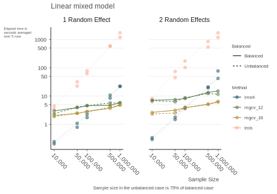

class: inverse middle center

```{r setup, include=FALSE}
options(htmltools.dir.version = FALSE, crayon.enabled = FALSE) # see https://github.com/hadley/mastering-shiny/issues/132

knitr::opts_chunk$set(
  # code
  echo      = T,
  eval      = T,
  message   = F,
  warning   = F,
  error     = F,
  comment   = NA,
  R.options = list(width = 220),
  # viz
  dev.args  = list(bg = 'transparent'),
  dev       = 'svglite',
  fig.align = 'center',
  out.width = '75%',
  fig.asp   = .75,
  # cache
  cache.rebuild = F,
  cache         = F
)

kable_df = function(data, digits=3, ...) {
  kableExtra::kable(
    data,
    digits = digits,
    format = 'html',
    booktabs = T,
    # longtable = F,
    linesep = "",
    ...,
  ) %>% 
    kableExtra::kable_styling(full_width = F)
}

perc = function(x, digits = 1) paste(rnd(x*100, digits = digits), '%')
```

```{r setup-extra, echo=FALSE, eval=TRUE}
xaringanExtra::use_xaringan_extra(
  c(
    "tile_view",
    "animate_css",
    "tachyons",
    'clipboard',
    'fit_screen',
    'webcam',
    'panelset'
  )
)

xaringanExtra::use_logo(
  image_url = 'https://raw.githubusercontent.com/m-clark/m-clark.github.io/master/img/mc_logo.png',
  link_url = 'https://m-clark.github.io',
  width = '5%',
  position =  xaringanExtra::css_position(bottom = "-3em", left = "1em"),
  exclude_class = c("title-slide")
)

xaringanExtra::use_animate_css()

xaringanExtra::style_share_again(
  share_buttons = c("twitter", "linkedin", "pocket")
)
```


```{r setup-packs, include = F, eval=TRUE}
library(tidyverse)
library(plotly)
library(visibly)
library(scico)
library(mixedup)
library(lme4)

load('../data/gpa.RData')
load('../data/pupils.RData')
load('../data/nurses.RData')
load('../data/speed_dating.RData')
load('../data/sociometric.RData')
# load('data/gpa')
```


### *Overview of Random Effects*

### *More Random Effects*

### *Common Extensions*

### **Issues**


---
class: inverse middle center animated fadeIn fadeOut # https://animate.style/ 

# More things to consider

---
class: inverse 

# Variance Accounted For

$R^2$ has limited utility beyond OLS

In the mixed case...

... do you include the random effect or not?

```{r}
performance::r2(gpa_mixed)
```

The difference can be quite dramatic!


---
class: inverse 

# Alternative Model Approaches


Fixed effects models
- Econometrics

Using cluster-robust standard errors

Generalized estimating equations (GEE)
- GLS, cluster-robust standard errors are a special case

Latent Growth Curve Models
- Identical to GLMM if set up appropriately

---
class: inverse 

# Sample Sizes


Small number of clusters
- variance estimates may not be good

Small number of observations within clusters
- Mixed models are fine with pre-post data!

Balanced/Missing values
- Balance not required
- Assumption is *missing at random*


---
class: inverse

# Sample Sizes


*Big data*

- lme4 can be very fast 
  - even with single random effect and millions of observations
- glmmTMB is slower
    - but often won't have convergence issues
- mgcv faster with millions if fewer clusters 


---
class: img-slide

# Sample Sizes

Randome effects from 1000, 100 levels




---
class: inverse 

# Model Comparison

ANOVA/Likelihood Ratio

Compare models with different fixed effects:
- change the default estimation from REML to ML
- models must have the same random effects structure

Compare models with different random effects:
- keep default REML
- models must have the same fixed effects

---
class: inverse 

# Model Comparison

AIC is probably okay, but can use AICc or CAIC

```{r, eval=FALSE}
AIC(standard_lme4_model)
AICcmodavg::AICc(standard_lme4_model)
cAIC4::cAIC(standard_lme4_model)
```


---
class: inverse 

# Convergence

Data is as data does. 

You will eventually have issues:
- such as lack of convergence
- estimates of zero variance
- other warnings 

These are not easy models to estimate, so don't be surprised if all doesn't go smoothly.

---
class: inverse 

# Convergence

Common sources of problems:

- Unscaled variables
- Other data problems (e.g. severe imbalance)
- Few clusters to estimate variances

Common solutions:

- Standardize, center, log numeric
- Consider simpler model
- Use different optimizer, more iterations


---
class: inverse 

# Summary

Mixed models will take more effort...

--

...because they're interesting!

That shouldn't keep you from exploring!

---
class: inverse middle center

# Moving on...


# [Part 1](https://m-clark.github.io/mixed-models-with-R-workshop/part-1.html)  <span class="" style = "width: 50px; display: inline-block"></span>[Part 2](https://m-clark.github.io/mixed-models-with-R-workshop/part-2.html)  <span class="" style = "width: 50px; display: inline-block"></span>[Part 3](https://m-clark.github.io/mixed-models-with-R-workshop/part-3.html)  <span class="" style = "width: 50px; display: inline-block"></span>[Part 5](https://m-clark.github.io/mixed-models-with-R-workshop/part-5.html)
